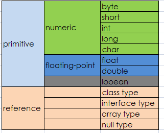

# 语言基础

本章介绍 Java 的语言基础。

## 变量（Variable）

前文也介绍了，对象的状态是存储在字段里面

```java
int cadence = 0;
int speed = 0;
int gear = 1;
```

Java 里面的变量包含如下类型：

* 实例变量/非静态字段(Instance Variables/Non-Static Fields):从技术上讲，对象存储他们的个人状态在“非静态字段”，也就是没有 static 关键字声明的字段。非静态字段也被称为实例变量，因为它们的值对于类的每个实例来说是唯一的（换句话说，就是每个对象）; 自行车的当前速度​独立于另一辆自行车的当前速度​。
* 类变量/静态字段(Class Variables/Static Fields) ：类变量是用 static 修饰符声明的字段，也就是告诉编译器无论类被实例化多少次，这个变量的存在，只有一个副本。特定种类自行车的齿轮数目的字段可以被标记为 static，因为相同的齿轮数量将适用于所有情况。代码`static int numGears = 6;`将创建一个这样的静态字段。此外，关键字 final 也可以加入，以指示的齿轮的数量不会改变。
* 局部变量(Local Variables)：类似于对象存储状态在字段里，方法通常会存放临时状态在局部变量里。语法与局部变量的声明类似（例如，`int count = 0;`）。没有特殊的关键字来指定一个变量是否是局部变量，是由该变量声明的位置决定的。局部变量是类的方法中的变量。
* 参数（Parameters）：前文的例子中经常可以看到`public static void main(String[] args)`，这里的 args 变量就是这个方法参数。要记住的重要一点是，参数都归类为“变量（variable）”而不是“字段（field）”。

如果我们谈论的是“一般的字段”（不包括局部变量和参数），我们可以简单地说“字段”。如果讨论适用于上述所有情况，我们可以简单地说“变量”。如果上下文要求一个区别，我们将使用特定的术语（静态字段，局部变量，等等）。你也偶尔会看到使用术语“成员（member）”。 类型的字段、方法和嵌套类型统称为它的成员。

### 命名

每一个编程语言都有它自己的一套规则和惯例的各种名目的，Java 编程语言对于命名变量的规则和惯例可以概括如下：

* 变量名称是区分大小写的。变量名可以是任何合法的标识符 - 无限长度的 Unicode字母和数字，以字母，美元符号`$`，或下划线`_`开头。但是惯例上推荐使用字母开头，而不是`$`或`_`。此外，按照惯例，美元符号从未使用过的。您可能会发现一些情况，自动生成的名称将包含美元符号，但你的变量名应该始终避免使用它。类似的约定存在下划线，不鼓励用“_”作为变量名开头。空格是不允许的。
* 随后的字符可以是字母，数字，美元符号，或下划线字符。惯例同样适用于这一规则。为变量命名，尽量是完整的单词，而不是神秘的缩写。这样做会使你的代码更容易阅读和理解，比如  cadence、speed 和 gear 会比缩写 c、s 和 g 更直观。同时请记住，您选择的名称不能是[关键字或保留字](../docs/keywords.md)。
* 如果您选择的名称只包含一个词，拼写单词全部小写字母。如果它由一个以上的单词，每个后续单词的第一个字母大写，如 gearRatio 和 currentGear。如果你的变量存储一个恒定值，使用`static final int NUM_GEARS = 6`，每个字母大写，并用以下划线分隔后续字符。按照惯例，下划线字符永远不会在其他地方使用。

详细的命名规范，可以参考《[Java 编码规范](<https://github.com/waylau/java-code-conventions>)》。

### 基本数据类型（Primitive Data Types）

Java 是静态类型（statically-typed）的语言，必须先声明再使用。基本数据类型之间不会共享状态。

主要有8种基本数据类型：



#### byte

byte 由1个字节8位表示，是最小的整数类型。主要用于节省内存空间关键。当操作来自网络、文件或者其他 IO 的数据流时，byte类型特别有用。取值范围为:[-128, 127]. byte 的默认值为 (byte)0,如果我们试图将取值范围外的值赋给 byte类型变量，则会出现编译错误，例如 `byte b = 128；`这个语句是无法通过编译的。一个有趣的问题，如果我们有个方法： public void test(byte b)。试图这么调用这个方法是错误的: test(0); 编译器会报错，类型不兼容！！！我们记得`byte b =0；`这是完全没有问题的，为什么在这里就出错啦？

这里涉及到一个叫字面值（literal）的问题，字面值就是表面上的值，例如整型字面值在源代码中就是诸如 5 ， 0， -200这样的。如果整型子面子后面加上L或者l，则这个字面值就是 long 类型，比如：1000L代表一个 long 类型的值。如果不加L或者l，则为 int 类型。基本类型当中的byte short int long都可以通过不加L的整型字面值（我们就称作int字面值吧）来创建，例如 byte b = 100； short s = 5；对于long类型，如果大小超出int所能表示的范围（32 bits），则必须使用L结尾来表示。整型字面值可以有不同的表示方式：16进制【0X or 0x】、10进制【nothing】、八进制【0】、2进制【0B or 0b】等，二进制字面值是JDK 7以后才有的功能。在赋值操作中，int字面值可以赋给byte short int long，Java语言会自动处理好这个过程。如果方法调用时不一样，调用test（0）的时候，它能匹配的方法是test（int），当然不能匹配test（byte）方法，至于为什么Java没有像支持赋值操作那样支持方法调用，不得而知。注意区别包装器与原始类型的自动转换（anto-boxing，auto-unboxing）。`byte d = 'A'；`也是合法的，字符字面值可以自动转换成16位的整数。
对byte类型进行数学运算时，会自动提升为int类型，如果表达式中有double或者float等类型，也是自动提升。所以下面的代码是错误的：

```java
byte t s1 = 100;
byte s2 = 'a';
byte sum = s1 + s2;//should cast by (byte)
```

#### short

用 16 位表示，取值范围为：[- 2^15, 2^15 - 1]。short可能是最不常用的类型了。可以通过整型字面值或者字符字面值赋值，前提是不超出范围（16 bit）。short类型参与运算的时候，一样被提升为int或者更高的类型。（顺序为 byte short int long float double).

#### int

32 bits, [- 2^31, 2^31 - 1].有符号的二进制补码表示的整数。常用语控制循环，注意byte 和 short在运算中会被提升为int类型或更高。Java 8以后，可以使用int类型表示无符号32位整数[ 0, 2^31 - 1]。

#### long

64 bits， [- 2^63, 2^63 - 1,默认值为0L].当需要计算非常大的数时，如果int不足以容纳大小，可以使用long类型。如果long也不够，可以使用BigInteger类。

#### char

16 bits, [0, 65535], [0, 2^16 -1],从'\u0000'到'\uffff'。无符号，默认值为'\u0000'。Java使用Unicode字符集表示字符，Unicode是完全国际化的字符集，可以表示全部人类语言中的字符。Unicode需要16位宽，所以Java中的char类型也使用16 bit表示。 赋值可能是这样的：

```java
char ch1 = 88;
char ch2 = 'A';
```

ASCII字符集占用了Unicode的前127个值。之所以把char归入整型，是因为Java为char提供算术运算支持，例如可以ch2++;之后ch2就变成Y。当char进行加减乘除运算的时候，也被转换成int类型，必须显式转化回来。

#### float

使用32 bit表示，对应单精度浮点数，遵循IEEE 754规范。运行速度相比double更快，占内存更小，但是当数值非常大或者非常小的时候会变得不精确。精度要求不高的时候可以使用float类型，声明赋值示例：

```java
float f1 =10;  
f1 = 10L;  
f1 = 10.0f;  //f1 = 10.0;默认为double
```

可以将byte、short、int、long、char赋给float类型，java自动完成转换。

#### double

64为表示，将浮点子面子赋给某个变量时，如果不显示在字面值后面加f或者F，则默认为double类型。java.lang.Math中的函数都采用double类型。

如果double和float都无法达到想要的精度，可以使用BigDecimal类。

#### boolean

boolean类型只有两个值true和false，默认为false。boolean与是否为0没有任何关系，但是可以根据想要的逻辑进行转换。许多地方都需要用到boolean类型。

除了上面列出的八种原始数据类型，Java 编程语言还提供了 [java.lang.String](https://docs.oracle.com/javase/8/docs/api/java/lang/String.html)用于字符串的特殊支持。双引号包围的字符串会自动创建一个新的 String 对象，例如`String s = "this is a string";`。String 对象是不可变的（immutable），这意味着一旦创建，它们的值不能改变。 String 类不是技术上的原始数据类型，但考虑由语言所赋予的特殊支持，你可能会倾向于认为它是这样的。更多关于 String 类的细节，可以参阅[简单数据对象（Simple Data Objects）]()。


#### 默认值

在字段声明时，有时并不必要分配一个值。字段被声明但尚未初始化时，将会由编译器设置一个合理的默认值。一般而言，根据数据类型此的不同，默认将为零或为 null。但良好的的编程风格不应该依赖于这样默认值。

下面的图表总结了上述数据类型的默认值。

数据类型 | 字段默认值
---- | ----
byte	| 0
short	| 0
int	| 0
long	| 0L
float	| 0.0f
double	| 0.0d
char	| '\u0000'
String (或任何对象) | null
boolean	| false

局部变量（Local Variable）略有不同，编译器不会指定一个默认值未初始化的局部变量。如果你不能初始化你声明的局部变量，那么请确保使用之前，给它分配一个值。访问一个未初始化的局部变量会导致编译时错误。