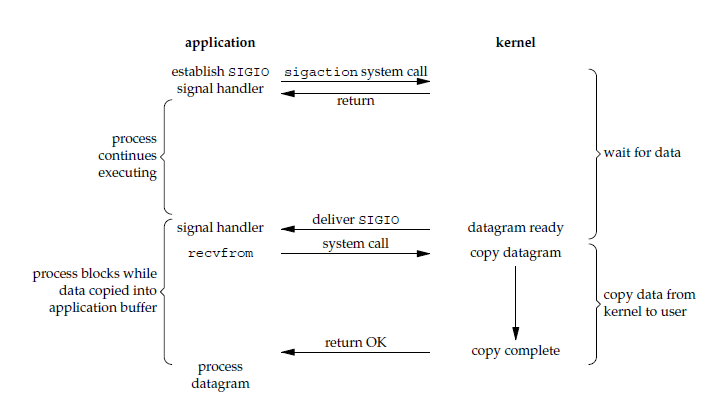
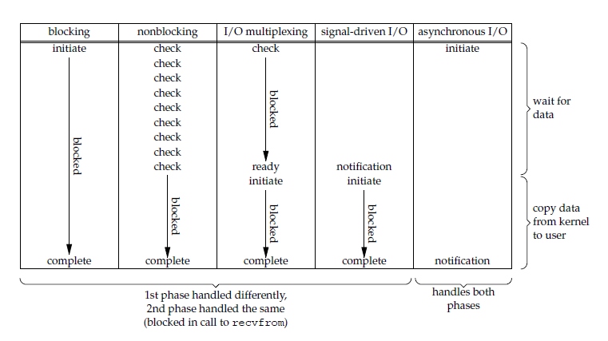

# I/O 模型的演进


什么是同步？什么是异步？阻塞和非阻塞又有什么区别？本文先从 Unix 的 I/O 模型讲起，介绍了5种常见的 I/O 模型。而后再引出 Java 的 I/O 模型的演进过程，并用实例说明如何选择合适的 Java I/O 模型来提高系统的并发量和可用性。

<!-- more -->

由于，Java 的 I/O 依赖于操作系统的实现，所以先了解 Unix 的 I/O 模型有助于理解 Java 的 I/O。

## 相关概念

### 同步和异步

描述的是用户线程与内核的交互方式：

* **同步**是指用户线程发起 I/O  请求后需要等待或者轮询内核 I/O 操作完成后才能继续执行；
* **异步**是指用户线程发起 I/O 请求后仍继续执行，当内核 I/O 操作完成后会通知用户线程，或者调用用户线程注册的回调函数。

### 阻塞和非阻塞

描述的是用户线程调用内核 I/O 操作的方式：

* **阻塞**是指 I/O 操作需要彻底完成后才返回到用户空间；
* **非阻塞**是指 I/O 操作被调用后立即返回给用户一个状态值，无需等到 I/O 操作彻底完成。

一个 I/O 操作其实分成了两个步骤：发起 I/O 请求和实际的 I/O 操作。 
阻塞 I/O 和非阻塞 I/O 的区别在于第一步，发起 I/O 请求是否会被阻塞，如果阻塞直到完成那么就是传统的阻塞 I/O ，如果不阻塞，那么就是非阻塞 I/O 。 
同步 I/O 和异步 I/O 的区别就在于第二个步骤是否阻塞，如果实际的 I/O 读写阻塞请求进程，那么就是同步 I/O 。 


## Unix I/O 模型
 
Unix 下共有五种 I/O 模型： 

1. 阻塞 I/O 
2. 非阻塞 I/O 
3. I/O 复用（select 和 poll） 
4. 信号驱动 I/O（SIGIO） 
5. 异步 I/O（Posix.1 的 aio_ 系列函数）

### 阻塞 I/O

请求无法立即完成则保持阻塞。

* 阶段1：等待数据就绪。网络 I/O 的情况就是等待远端数据陆续抵达；磁盘I/O的情况就是等待磁盘数据从磁盘上读取到内核态内存中。
* 阶段2：数据拷贝。出于系统安全,用户态的程序没有权限直接读取内核态内存,因此内核负责把内核态内存中的数据拷贝一份到用户态内存中。


### 非阻塞 I/O

* socket 设置为 NONBLOCK（非阻塞）就是告诉内核，当所请求的 I/O 操作无法完成时，不要将进程睡眠，而是返回一个错误码(EWOULDBLOCK) ，这样请求就不会阻塞
* I/O 操作函数将不断的测试数据是否已经准备好，如果没有准备好，继续测试，直到数据准备好为止。整个 I/O 请求的过程中，虽然用户线程每次发起 I/O 请求后可以立即返回，但是为了等到数据，仍需要不断地轮询、重复请求，消耗了大量的 CPU 的资源
* 数据准备好了，从内核拷贝到用户空间。


一般很少直接使用这种模型，而是在其他 I/O 模型中使用非阻塞 I/O 这一特性。这种方式对单个 I/O 请求意义不大,但给 I/O 多路复用铺平了道路.

### I/O 复用（异步阻塞 I/O）

I/O 复用会用到 select 或者 poll 函数，这两个函数也会使进程阻塞，但是和阻塞 I/O 所不同的的，这两个函数可以同时阻塞多个 I/O 操作。而且可以同时对多个读操作，多个写操作的 I/O 函数进行检测，直到有数据可读或可写时，才真正调用 I/O 操作函数。 


从流程上来看，使用 select 函数进行 I/O 请求和同步阻塞模型没有太大的区别，甚至还多了添加监视 socket，以及调用 select 函数的额外操作，效率更差。但是，使用 select 以后最大的优势是用户可以在一个线程内同时处理多个 socket 的 I/O 请求。用户可以注册多个 socket，然后不断地调用 select 读取被激活的 socket，即可达到在同一个线程内同时处理多个 I/O 请求的目的。而在同步阻塞模型中，必须通过多线程的方式才能达到这个目的。

I/O 多路复用模型使用了 Reactor 设计模式实现了这一机制。

调用 select / poll 该方法由一个用户态线程负责轮询多个 socket,直到某个阶段1的数据就绪,再通知实际的用户线程执行阶段2的拷贝。
通过一个专职的用户态线程执行非阻塞I/O轮询,模拟实现了阶段一的异步化

### 信号驱动 I/O（SIGIO） 

首先我们允许 socket 进行信号驱动 I/O,并安装一个信号处理函数，进程继续运行并不阻塞。当数据准备好时，进程会收到一个 SIGIO 信号，可以在信号处理函数中调用 I/O 操作函数处理数据。




### 异步 I/O

调用 aio_read 函数，告诉内核描述字，缓冲区指针，缓冲区大小，文件偏移以及通知的方式，然后立即返回。当内核将数据拷贝到缓冲区后，再通知应用程序。


异步 I/O 模型使用了 Proactor 设计模式实现了这一机制。

告知内核,当整个过程(包括阶段1和阶段2)全部完成时,通知应用程序来读数据.

## 几种 I/O 模型的比较 

前四种模型的区别是阶段1不相同，阶段2基本相同，都是将数据从内核拷贝到调用者的缓冲区。而异步 I/O 的两个阶段都不同于前四个模型。

同步 I/O 操作引起请求进程阻塞，直到 I/O 操作完成。异步 I/O 操作不引起请求进程阻塞。




## 常见 Java I/O 模型

在了解了 UNIX 的 I/O 模型之后，其实 Java 的 I/O 模型也是类似。

## “阻塞I/O”模式  

在上一节 Socket 章节中的 EchoServer 就是一个简单的阻塞 I/O 例子，服务器启动后，等待客户端连接。在客户端连接服务器后，服务器就阻塞读写取数据流。

EchoServer 代码：

```java
public class EchoServer {
	public static int DEFAULT_PORT = 7;

	public static void main(String[] args) throws IOException {

		int port;

		try {
			port = Integer.parseInt(args[0]);
		} catch (RuntimeException ex) {
			port = DEFAULT_PORT;
		}
        
        try (
            ServerSocket serverSocket =
                new ServerSocket(port);
            Socket clientSocket = serverSocket.accept();     
            PrintWriter out =
                new PrintWriter(clientSocket.getOutputStream(), true);                   
            BufferedReader in = new BufferedReader(
                new InputStreamReader(clientSocket.getInputStream()));
        ) {
            String inputLine;
            while ((inputLine = in.readLine()) != null) {
                out.println(inputLine);
            }
        } catch (IOException e) {
            System.out.println("Exception caught when trying to listen on port "
                + port + " or listening for a connection");
            System.out.println(e.getMessage());
        }
    }
}
```

## 改进为“阻塞I/O+多线程”模式  

使用多线程来支持多个客户端来访问服务器。

主线程 MultiThreadEchoServer.java

```java
public class MultiThreadEchoServer {
	public static int DEFAULT_PORT = 7;

	public static void main(String[] args) throws IOException {

		int port;

		try {
			port = Integer.parseInt(args[0]);
		} catch (RuntimeException ex) {
			port = DEFAULT_PORT;
		}
		Socket clientSocket = null;
		try (ServerSocket serverSocket = new ServerSocket(port);) {
			while (true) {
				clientSocket = serverSocket.accept();
				
				// MultiThread
				new Thread(new EchoServerHandler(clientSocket)).start();
			}
		} catch (IOException e) {
			System.out.println(
					"Exception caught when trying to listen on port " + port + " or listening for a connection");
			System.out.println(e.getMessage());
		}
	}
}
```

处理器类 EchoServerHandler.java

```java
public class EchoServerHandler implements Runnable {
	private Socket clientSocket;

	public EchoServerHandler(Socket clientSocket) {
		this.clientSocket = clientSocket;
	}

	@Override
	public void run() {
		try (PrintWriter out = new PrintWriter(clientSocket.getOutputStream(), true);
				BufferedReader in = new BufferedReader(new InputStreamReader(clientSocket.getInputStream()));) {

			String inputLine;
			while ((inputLine = in.readLine()) != null) {
				out.println(inputLine);
			}
		} catch (IOException e) {
			System.out.println(e.getMessage());
		}
	}
}
```

**存在问题**：每次接收到新的连接都要新建一个线程，处理完成后销毁线程，代价大。当有大量地短连接出现时，性能比较低。


## 改进为“阻塞I/O+线程池”模式  

针对上面多线程的模型中，出现的线程重复创建、销毁带来的开销，可以采用线程池来优化。每次接收到新连接后从池中取一个空闲线程进行处理，处理完成后再放回池中，重用线程避免了频率地创建和销毁线程带来的开销。

主线程 ThreadPoolEchoServer.java

```java
public class ThreadPoolEchoServer {
	public static int DEFAULT_PORT = 7;

	public static void main(String[] args) throws IOException {

		int port;

		try {
			port = Integer.parseInt(args[0]);
		} catch (RuntimeException ex) {
			port = DEFAULT_PORT;
		}
		ExecutorService threadPool = Executors.newFixedThreadPool(5);
		Socket clientSocket = null;
		try (ServerSocket serverSocket = new ServerSocket(port);) {
			while (true) {
				clientSocket = serverSocket.accept();
				
				// Thread Pool
				threadPool.submit(new Thread(new EchoServerHandler(clientSocket)));
			}
		} catch (IOException e) {
			System.out.println(
					"Exception caught when trying to listen on port " + port + " or listening for a connection");
			System.out.println(e.getMessage());
		}
	}
}
```

**存在问题**：在大量短连接的场景中性能会有提升，因为不用每次都创建和销毁线程，而是重用连接池中的线程。但在大量长连接的场景中，因为线程被连接长期占用，不需要频繁地创建和销毁线程，因而没有什么优势。

虽然这种方法可以适用于小到中度规模的客户端的并发数，如果连接数超过 100,000或更多，那么性能将很不理想。

## 改进为“非阻塞I/O”模式  

"阻塞I/O+线程池"网络模型虽然比"阻塞I/O+多线程"网络模型在性能方面有提升，但这两种模型都存在一个共同的问题：读和写操作都是同步阻塞的,面对大并发（持续大量连接同时请求）的场景，需要消耗大量的线程来维持连接。CPU 在大量的线程之间频繁切换，性能损耗很大。一旦单机的连接超过1万，甚至达到几万的时候，服务器的性能会急剧下降。

而 NIO 的 Selector 却很好地解决了这个问题，用主线程（一个线程或者是 CPU 个数的线程）保持住所有的连接，管理和读取客户端连接的数据，将读取的数据交给后面的线程池处理，线程池处理完业务逻辑后，将结果交给主线程发送响应给客户端，少量的线程就可以处理大量连接的请求。

Java NIO 由以下几个核心部分组成：

* Channel
* Buffer
* Selector

要使用 Selector，得向 Selector 注册 Channel，然后调用它的 select()方法。这个方法会一直阻塞到某个注册的通道有事件就绪。一旦这个方法返回，线程就可以处理这些事件，事件的例子有如新连接进来，数据接收等。

主线程 NonBlokingEchoServer.java

```java
public class NonBlokingEchoServer {
	public static int DEFAULT_PORT = 7;

	public static void main(String[] args) throws IOException {

		int port;

		try {
			port = Integer.parseInt(args[0]);
		} catch (RuntimeException ex) {
			port = DEFAULT_PORT;
		}
		System.out.println("Listening for connections on port " + port);

		ServerSocketChannel serverChannel;
		Selector selector;
		try {
			serverChannel = ServerSocketChannel.open();
			InetSocketAddress address = new InetSocketAddress(port);
			serverChannel.bind(address);
			serverChannel.configureBlocking(false);
			selector = Selector.open();
			serverChannel.register(selector, SelectionKey.OP_ACCEPT);
		} catch (IOException ex) {
			ex.printStackTrace();
			return;
		}

		while (true) {
			try {
				selector.select();
			} catch (IOException ex) {
				ex.printStackTrace();
				break;
			}
			Set<SelectionKey> readyKeys = selector.selectedKeys();
			Iterator<SelectionKey> iterator = readyKeys.iterator();
			while (iterator.hasNext()) {
				SelectionKey key = iterator.next();
				iterator.remove();
				try {
					if (key.isAcceptable()) {
						ServerSocketChannel server = (ServerSocketChannel) key.channel();
						SocketChannel client = server.accept();
						System.out.println("Accepted connection from " + client);
						client.configureBlocking(false);
						SelectionKey clientKey = client.register(selector,
								SelectionKey.OP_WRITE | SelectionKey.OP_READ);
						ByteBuffer buffer = ByteBuffer.allocate(100);
						clientKey.attach(buffer);
					}
					if (key.isReadable()) {
						SocketChannel client = (SocketChannel) key.channel();
						ByteBuffer output = (ByteBuffer) key.attachment();
						client.read(output);
					}
					if (key.isWritable()) {
						SocketChannel client = (SocketChannel) key.channel();
						ByteBuffer output = (ByteBuffer) key.attachment();
						output.flip();
						client.write(output);
						
						output.compact();
					}
				} catch (IOException ex) {
					key.cancel();
					try {
						key.channel().close();
					} catch (IOException cex) {
					}
				}
			}
		}

	}
}
```

## 改进为“异步I/O”模式  

Java SE 7 版本之后，引入了异步 I/O （NIO.2） 的支持，为构建高性能的网络应用提供了一个利器。

主线程 AsyncEchoServer.java

```java
public class AsyncEchoServer {

	public static int DEFAULT_PORT = 7;

	public static void main(String[] args) throws IOException {
		int port;

		try {
			port = Integer.parseInt(args[0]);
		} catch (RuntimeException ex) {
			port = DEFAULT_PORT;
		}

		ExecutorService taskExecutor = Executors.newCachedThreadPool(Executors.defaultThreadFactory());
		// create asynchronous server socket channel bound to the default group
		try (AsynchronousServerSocketChannel asynchronousServerSocketChannel = AsynchronousServerSocketChannel.open()) {
			if (asynchronousServerSocketChannel.isOpen()) {
				// set some options
				asynchronousServerSocketChannel.setOption(StandardSocketOptions.SO_RCVBUF, 4 * 1024);
				asynchronousServerSocketChannel.setOption(StandardSocketOptions.SO_REUSEADDR, true);
				// bind the server socket channel to local address
				asynchronousServerSocketChannel.bind(new InetSocketAddress(port));
				// display a waiting message while ... waiting clients
				System.out.println("Waiting for connections ...");
				while (true) {
					Future<AsynchronousSocketChannel> asynchronousSocketChannelFuture = asynchronousServerSocketChannel
							.accept();
					try {
						final AsynchronousSocketChannel asynchronousSocketChannel = asynchronousSocketChannelFuture
								.get();
						Callable<String> worker = new Callable<String>() {
							@Override
							public String call() throws Exception {
								String host = asynchronousSocketChannel.getRemoteAddress().toString();
								System.out.println("Incoming connection from: " + host);
								final ByteBuffer buffer = ByteBuffer.allocateDirect(1024);
								// transmitting data
								while (asynchronousSocketChannel.read(buffer).get() != -1) {
									buffer.flip();
									asynchronousSocketChannel.write(buffer).get();
									if (buffer.hasRemaining()) {
										buffer.compact();
									} else {
										buffer.clear();
									}
								}
								asynchronousSocketChannel.close();
								System.out.println(host + " was successfully served!");
								return host;
							}
						};
						taskExecutor.submit(worker);
					} catch (InterruptedException | ExecutionException ex) {
						System.err.println(ex);
						System.err.println("\n Server is shutting down ...");
						// this will make the executor accept no new threads
						// and finish all existing threads in the queue
						taskExecutor.shutdown();
						// wait until all threads are finished
						while (!taskExecutor.isTerminated()) {
						}
						break;
					}
				}
			} else {
				System.out.println("The asynchronous server-socket channel cannot be opened!");
			}
		} catch (IOException ex) {
			System.err.println(ex);
		}
	}
}
```

## 源码

本章例子的源码，可以在 <https://github.com/waylau/essential-java> 中 `com.waylau.essentialjava.net.echo` 包下找到。